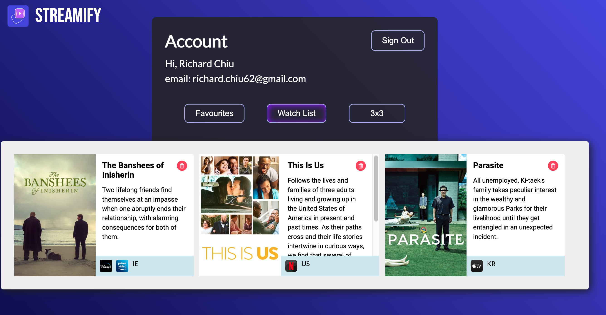

# Richard Chiu Capstone 2023 - Streamify

```sh
hosted on: https://richard-chiu-capstone-bs2023.web.app/
```

Application is designed for desktop use: Ideally 1400px - 2000px width. Use these dimensions for best user experience.

Streamify is a web application that helps users find where to watch movies and TV shows across multiple streaming platforms, including Netflix, Disney Plus, and Amazon Prime. It utilizes AI technology to provide new show recommendations through a chatbot prompt. Users can create an account to save their favourite movies and TV shows for quick access.

## Features

- Custom search engine to find show details and streaming availability
- AI chatbot to get show recommendations
- Easily create a 3x3 grid of enjoyed shows
- Watch/Favourite list functionality


## Search

- Change country on top right of search to filter region for show search
- Poster image will take you to trailer
- Streaming service icon will take you directly to the show on that service
- icons next to title will save show to account


## Chat

- ask chat for a show you want with prompts
- chat will output a show and generate a card for ease of access


## 3x3

- search for a show, drag and drop!
- pick a theme such as comedy shows - arrange, save, and show to your friends


## Account

- watch list, favourites, and 3x3 will be saved to account if logged in



### Getting Started

- Clone the repository to your local machine.
- Install the required dependencies by running npm install.
- Obtain API keys and URLs according to the .env.sample.
- Start the server by running npm start.
- Once the server is running, you can access the application by visiting http://localhost:3000 in your web browser.

### API keys Needed:

- Firebase: https://console.firebase.google.com/u/0/
- Streaming Availability: https://rapidapi.com/movie-of-the-night-movie-of-the-night-default/api/streaming-availability
- OpenAi: https://platform.openai.com/docs/api-reference
